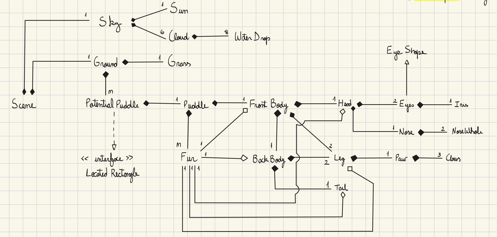

# Java OOP – Animal Drawing Scene

A simple Java Object-Oriented Programming (OOP) project that draws an animal and a scene using class-based structure and graphical rendering. Designed as an academic exercise in abstraction, inheritance, and encapsulation.

---

## 🧩 Project Features

- Written in Java using Eclipse with JDK 8+ (JRE libraries)
- Custom `Poodle` and `Scene` classes
- Uses OOP principles: inheritance, encapsulation, polymorphism
- Simple drawing via `Graphics` (e.g., on `JPanel` or `Canvas`)
- Easily extendable with new animals, backgrounds, or animations

---

## 📌 UML Diagram (LAB2!)

Below is the UML diagram representing the class hierarchy of the project in LAB2:

