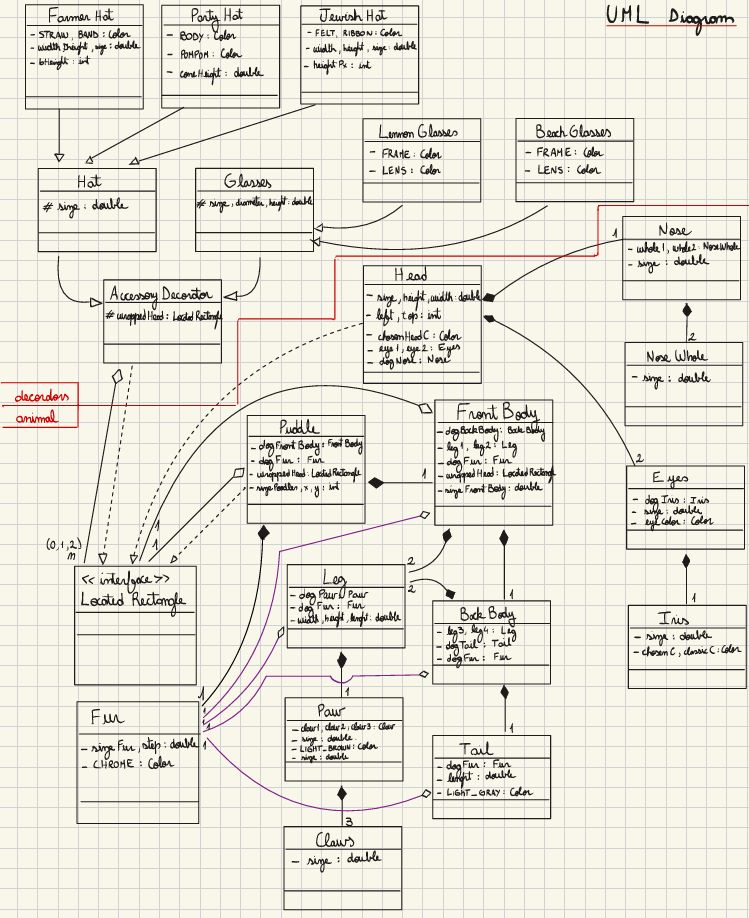
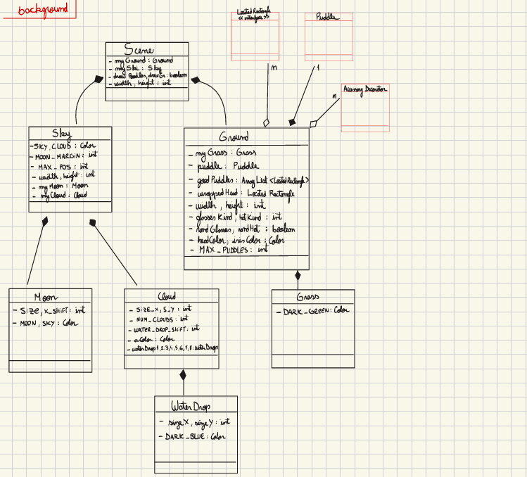
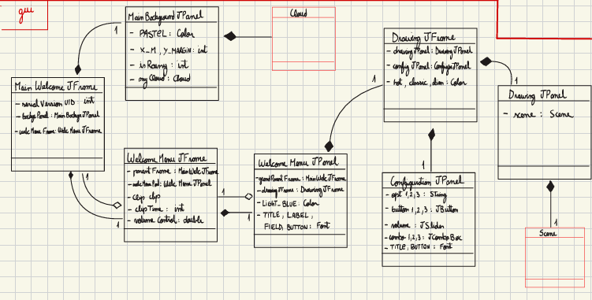

# Java OOP – Animal Drawing Scene

A Swing-based Java application that builds a randomised poodle scene.
Each poodle is composed hierarchically, rendered through recursive drawAt calls, and implements LocatedRectangle to expose a bounding box.
A side panel lets users toggle fur colours, hat/glasses styles, rainfall, and scene volume. GUI actions propagate to the Scene object, which updates internal state and triggers repaint.
Accessories are layered at run-time via the Decorator pattern, allowing endless combinations without changing core classes.
Collision logic guarantees no two poodles overlap. The final deliverable demonstrates deep inheritance, aggregation vs composition distinctions, event-driven GUI, random variation utilities, and a fully working design-pattern implementation

---

## 🧩 Project Features

- Written in Java using Eclipse with JDK 8+ (JRE libraries)
- Interface driven anti collision mechanism —every drawable animal and decorators implement LocatedRectangle. Scene calls intersects to lay out non-overlapping poodles.
- Drawing via Swing library, `Graphics`, `JPanel`, and `JFrame`. GUI to domain channel —controls mutate the scene state via getters/setters.
- Easily extendable with new animals, backgrounds, or animations

---

## 📌 Spoiler (LAB2!)

Below is the UML diagram representing the intricate class hierarchy of the project in LAB4_Final:

## 📌 UML Diagram

