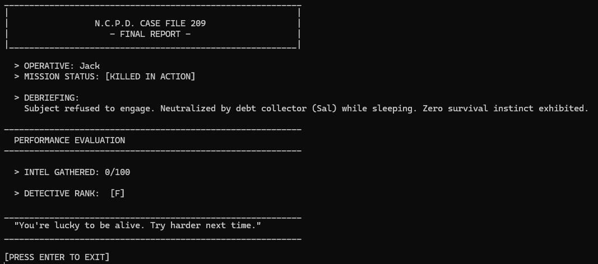

# N.C.P.D. Case File 209

### A Text-Based Noir Mystery

This is an interactive detective fiction game developed in Java. You play as **Jack**, a private investigator in a rain-soaked cyberpunk city. Your goal is to find Vivian Miller before the trail goes cold.

The game features branching narratives, multiple endings, and a performance evaluation system based on your detective skills.

---

## 🎮 How to Play

You do not need to install an IDE to play. Everything you need is in the **`PLAY!`** folder.

1. Open the folder named **`PLAY!`** in this repository.
2. Download/Unzip the file for your computer:
   * **Windows:** `DetectiveGame_Windows.zip`
   * **Mac:** `DetectiveGame_Mac.zip`
3. Launch the game:
   * **Windows Users:** Double-click `Play.bat`.
   * **Mac Users:** Double-click `Play.command`.

*(Note: Java must be installed on your machine to run the game.)*

---

## 📸 Screenshots (Spoilers)

**Game Over Screen**

**Final Investigation Report**
